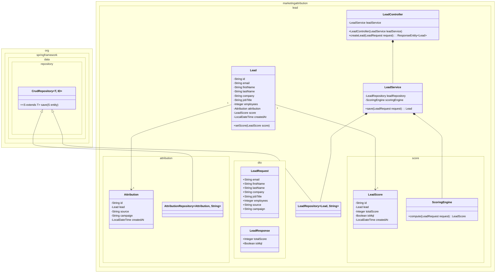

# Marketing Attribution & Lead Scoring API (Spring Boot)

An enterprise-grade Java microservice designed to ingest, score, and relationally map inbound marketing leads. Built with **Java 26** and **Spring Boot 4.0**, this project demonstrates modern Domain-Driven Design (DDD), strict schema validation, database migration management, and secure observability.

## 🚀 Technical Highlights

- **Domain-Driven Design (DDD):** Packaged by feature rather than by layer, ensuring high cohesion, low coupling, and strict encapsulation of domain logic.
- **Deterministic Schema Management:** Disables Hibernate's risky `ddl-auto` generation in favor of **Flyway**, ensuring all database schema changes are immutable, version-controlled, and CI/CD ready.
- **Atomic Relational Persistence:** Leverages Spring Data JPA and `@Transactional` to guarantee atomicity across `Lead`, `Attribution`, and `LeadScore` entity insertions.
- **Immutable DTOs:** Utilizes modern Java `record` types combined with **Jakarta Validation** to enforce strict runtime boundaries and input sanitization at the controller layer.
- **Distributed-Ready Identifiers:** Replaces traditional auto-incrementing integers with **UUIDs** across all entities to support database sharding and asynchronous event-driven queues (e.g., Kafka).
- **Secure Observability:** Isolates **Spring Boot Actuator** telemetry and health checks to a dedicated management port, preventing public information disclosure while enabling Kubernetes readiness/liveness probes.

## 🛠 Tech Stack

- **Language:** Java 26
- **Framework:** Spring Boot 4.0.x
- **Persistence:** Spring Data JPA / Hibernate
- **Database:** SQLite
- **Migrations:** Flyway 12.x
- **Validation:** Jakarta Bean Validation
- **Tooling:** Gradle, Lombok

## 📁 Architectural Structure

The codebase strictly adheres to Package-by-Feature to isolate business domains:

```text
src/main/java/com/yourdomain/marketingapi/
├── core/                           # Global configurations and exception handlers
├── lead/                           # The Lead Domain (High Cohesion)
│   ├── dto/                        # Immutable Request/Response Records
│   ├── score/                      # Decoupled Scoring Engine (@Component)
│   ├── LeadController.java         # HTTP routing and validation
│   ├── LeadService.java            # Transactional orchestration
│   └── LeadRepository.java         # Data access
```



## 🚀 Getting Started

### Prerequisites
- JDK 26+
- Gradle 9.4.0

### Installation & Execution

1. Clone the repository and navigate to the project root.
2. Ensure you have a clean slate (this custom task drops any existing local SQLite databases):
   ```bash
   ./gradlew clean
   ```
3. Boot the application:
   ```bash
   ./gradlew bootRun
   ```
   *Note: On startup, Flyway will automatically execute `V1__Create_lead_tables.sql` to construct the database before Spring Boot accepts traffic.*

## 🔌 API Documentation

### POST `/leads`

Ingests a new lead, executes the scoring engine, and persists the relational data.

**Request:**
```bash
curl -X POST http://localhost:3000/leads \
 -H "Content-Type: application/json" \
 -d '{"email": "director@enterprise.com", "firstName": "John", "lastName": "Smith", "jobTitle": "Director of Engineering", "employees": 1200, "source": "LinkedIn"}'
```

## 📊 Observability (Actuator)

To prevent public exposure of internal infrastructure, Spring Boot Actuator is mapped to a secondary management port.

**Health Check (Liveness/Readiness):**
```bash
curl http://localhost:3001/actuator/health
```

**Flyway Migration Status:**
```bash
curl http://localhost:3001/actuator/flyway
```

## 🧠 Architectural Decisions

- **Why Flyway over Hibernate DDL?** Relying on Hibernate's `ddl-auto=update` can cause catastrophic schema drifts and table locks in production. By combining Flyway with `spring.jpa.hibernate.ddl-auto=validate`, the application guarantees the Java domain model perfectly matches the physical database schema before starting.
- **Why Isolate the Scoring Engine?** By extracting the lead scoring logic into a standalone `@Component`, the business rules can be rigorously unit-tested without loading the Spring Application Context or mocking database connections.
- **Why Constructor Injection?** Avoided `@Autowired` fields in favor of constructor injection to ensure components remain immutable and easily instantiable in test environments.

---
*Developed as a demonstration of Java architecture and Spring Boot 4.0 best practices.*
